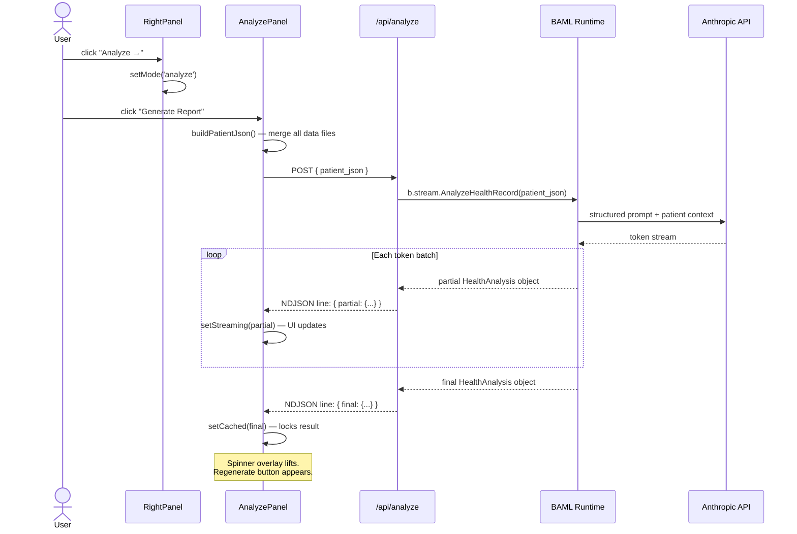

# LLM Pipeline Architecture

The AI analysis panel synthesizes the full patient record — all visits, all systems — into a structured clinical narrative. This document covers the data flow, BAML schema, system prompt design, and streaming protocol.

---

## Sequence Diagram



---

## BAML Schema (`baml_src/health_analysis.baml`)

BAML (Boundary ML) provides Schema-Aligned Parsing — the LLM output is parsed into typed objects even as tokens stream in.

```baml
class ConditionInsight {
  name        string
  trajectory  "stable" | "worsening" | "new" | "improving" | "chronic"
  was         string?   // prior session description — null on first appearance
  now         string    // current severity / label
  clinical    string    // 2–3 sentence direct physician commentary
  urgency     "monitor" | "address_soon" | "urgent"
  @@stream.done         // card only renders when ALL fields are complete
}

class LabInsight {
  marker         string
  value          string
  unit           string
  interpretation string
  @@stream.done         // same — no half-rendered lab cards
}

class HealthAnalysis {
  headline         string             // one punchy sentence capturing overall picture
  trajectory_score int                // 1 (active crisis) → 10 (optimal) — honest
  primary_concerns ConditionInsight[]
  lab_highlights   LabInsight[]
  watchlist        string[]           // monitoring items, not yet alarming
  recommendations  string[]           // specific, immediately actionable
}

function AnalyzeHealthRecord(patient_json: string) -> HealthAnalysis {
  client Claude
  prompt #"
    {{ ctx.output_format }}   // BAML injects schema enforcement instructions here
    [system prompt]
    Patient data: {{ patient_json }}
  "#
}
```

### Why `@@stream.done`

Without it, BAML would render a `ConditionInsight` card the moment the first field (`name`) arrives — producing a card that flickers through partial states. `@@stream.done` holds the item until all fields complete, then pushes it atomically. The array grows one complete card at a time, which looks intentional rather than broken.

`headline` and `trajectory_score` do NOT have `@@stream.done` — they stream token by token, which is correct. The headline typing in gives a live "thinking" feel.

---

## System Prompt Design

**Voice:** Fellowship-trained internist, Johns Hopkins + musculoskeletal/metabolic fellowship. Known for unhedged clinical language.

**Key constraints injected into the prompt:**

| Instruction | Why |
|---|---|
| "Reference every finding by anatomical name and ICD-10 label" | Prevents vague shorthand ("back issue") |
| "Draw cross-signal connections across systems" | Forces the cross-specialty synthesis no single doctor currently provides |
| "trajectory_score must be honest" | Prevents score inflation; explicit example: L5 nerve root + 9yr progression ≠ above 4 |
| "primary_concerns ordered by urgency descending" | Determines card render order — most critical first |
| "recommendations: specific and immediately actionable" | Prevents "see a doctor" outputs |
| "headline: one punchy sentence, no padding" | Prevents corporate medicine hedging in the lede |

---

## Patient Context Builder (`buildPatientJson`)

All data files are merged into a single JSON string passed as `patient_json`:

```typescript
// src/components/AnalyzePanel.tsx
function buildPatientJson(): string {
  return JSON.stringify({
    patientId:  conditionsData.patientId,
    sessions:   conditionsData.sessions,       // session index with dates
    skeletal:   conditionsData.conditions,     // per-bone history across all sessions
    organs:     conditionsOrgans.conditions,   // per-organ history across all sessions
    biomarkers: biomarkersData.biomarkers,     // 40+ markers, 5 categories, 2 sessions
    highlights: labHighlightsData.highlights,  // flagged labs with body targets
  })
}
```

Passing ALL sessions (not just the selected one) enables trajectory language: "nine-year progression," "first appeared in May 2017," etc. The LLM sees the complete longitudinal record.

---

## NDJSON Streaming Protocol

The API route returns `application/x-ndjson`. Each line is one JSON message:

```
{ "partial": { "headline": "Nine-year lumbar...", "trajectory_score": null, ... } }
{ "partial": { "headline": "Nine-year lumbar collapse", "trajectory_score": 3, ... } }
{ "partial": { "headline": "...", "primary_concerns": [{ complete ConditionInsight }], ... } }
{ "final": { ... complete HealthAnalysis ... } }
```

Client-side reader in `AnalyzePanel`:

```typescript
const reader  = res.body.getReader()
const decoder = new TextDecoder()
let   buffer  = ''

while (true) {
  const { done, value } = await reader.read()
  if (done) break
  buffer += decoder.decode(value, { stream: true })

  const lines = buffer.split('\n')
  buffer = lines.pop() ?? ''          // keep incomplete line in buffer

  for (const line of lines) {
    const msg = JSON.parse(line.trim())
    if (msg.partial) setStreaming(msg.partial)
    if (msg.final)   setCached(msg.final)
  }
}
```

`display = cached ?? streaming` — once `final` arrives and locks into `cached`, the `streaming` state is irrelevant.

---

## Caching & Regeneration

Results are cached in component state (`useState<HealthAnalysis | null>`), not in a server cache or localStorage. This is intentional:

- No stale result risk across sessions or time
- Regenerate is explicit user action, not automatic
- Per-mount: navigating away and back triggers a fresh call on next "Generate Report" click — not automatic re-fetch

```
cached = null  →  "Generate Report" button shown
cached = data  →  results shown + "Regenerate" button
regenerate()   →  setCached(null), setStreaming(null), run()
```

---

## LLM Client Config (`baml_src/clients.baml`)

```baml
client<llm> Claude {
  provider anthropic
  options {
    model   "claude-sonnet-4-6"
    api_key env.ANTHROPIC_API_KEY
  }
}
```

`ANTHROPIC_API_KEY` lives in `.env.local` (never committed). Next.js server route resolves it at runtime. The key never appears in any client-side bundle or network response.

---

## Key Technical Constraints

| Constraint | Detail |
|---|---|
| `withBaml()` removed | Conflicts with Next.js 16 Turbopack (webpack vs Turbopack). Use `serverExternalPackages: ['@boundaryml/baml']` instead. |
| CJS generator only | `module_format "esm"` produces `.js` extension imports Turbopack can't resolve. Default CJS works. |
| `serverExternalPackages` required | BAML includes a native `.node` addon (`@boundaryml/baml-darwin-arm64`). Turbopack can't bundle native addons — must be externalized. |
| Regenerate `baml_client/` | Run `npx baml-cli generate` after any change to `baml_src/*.baml`. Never hand-edit `baml_client/`. |

---

## Backlog: Per-Section Citations

Add `references: Reference[]` to `ConditionInsight` and `LabInsight`. Render as glass-pill chips below each card's clinical text.

**v1 — safe, no hallucinated URLs:**
Claude constructs PubMed search links (`https://pubmed.ncbi.nlm.nih.gov/?term=<encoded>`) and stable org guideline pages (AHA, ACC, USPSTF). Never fabricates DOIs.

**v2 — verified URLs:**
Second BAML function `EnrichWithCitations` with `web_search` tool replaces search links with exact paper URLs.

See ROADMAP.md Phase 5 backlog for full schema and UI spec.
