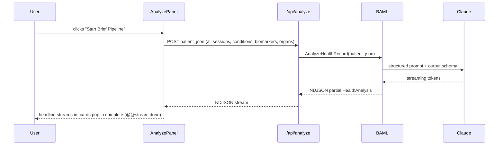
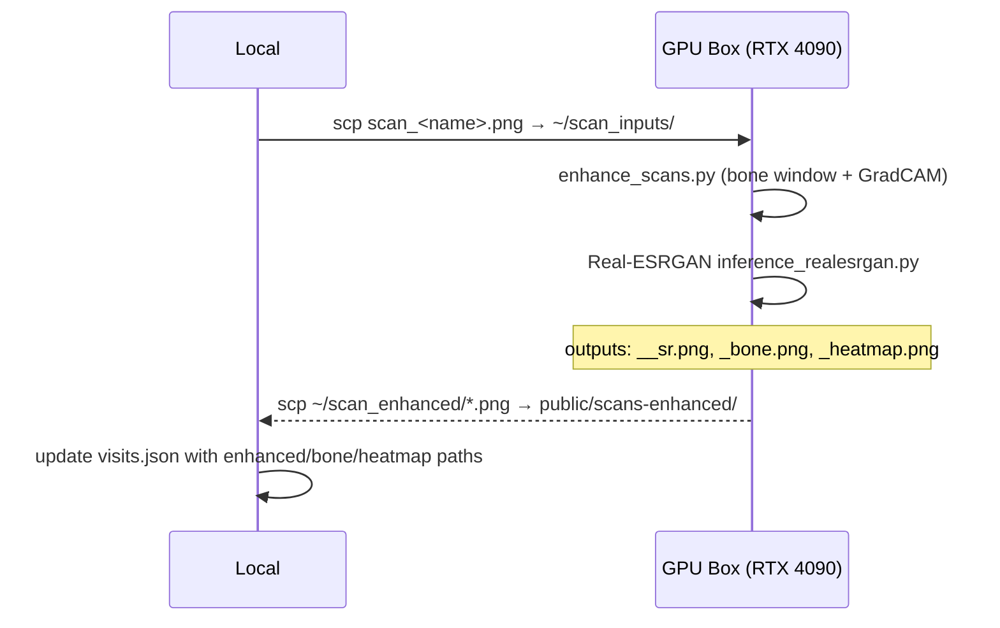
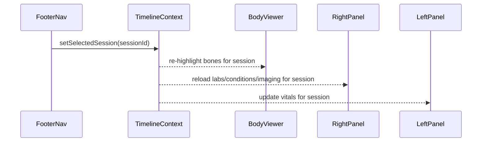

# Soma

I got tired of logging into a health insurance portal that showed me nothing. Cigna — like every major US insurer — gives you a "member portal" that's a maze of PDFs, broken filters, and lab results with no context. I've been their patient for years. I have CT scans, bloodwork going back a decade, clinical notes, imaging reports — all of it sitting in a system that treats me like a claims number, not a person. So I downloaded all of it. Every encounter, every biomarker, every scan. Then I built Soma.

Soma is what a personal health intelligence platform should look like. Not a wellness app. Not a symptom checker. A real tool for someone who takes their own biology seriously and wants their data to work for them. It took a few weeks to build the core, and I kept going because the more I wired in, the more I realized how much signal was just sitting there unclaimed — patterns in lab trends, imaging findings that never got followed up on, a clinical narrative that existed nowhere in my chart but could be synthesized in seconds.

This is built entirely on my own real personal health records. The 3D body isn't decorative — it's annotated with actual conditions from actual clinical notes. The biomarker charts aren't seeded with fake ranges — they're my numbers, across real visits, over real time. The ML imaging pipeline ran against scans I pulled directly from Philips IntelliSpace PACS. If this feels more credible than most health tech demos, it's because it is.

The point isn't the tech. The point is that this is what patients deserve by default, and it's embarrassing that nobody has built it yet. Soma is my argument that they should.

---

## Features

### 3D Skeleton Viewer
An interactive Three.js skeleton rendered from `skeleton_lo.glb` — a rigged, mesh-precise model with individually named bones covering every major anatomical structure. Conditions from clinical data are mapped to specific bones and rendered with a three-tier highlight system: **red** for critical/active diagnoses, **yellow** for watch conditions, **cyan** for lab-flagged states. Bone annotations surface as compact glass cards via `@react-three/drei`'s `<Html>` portal system, floating in 3D space at z-5 — above the WebGL canvas, below the UI panels. The WebGL compositor layer is carefully controlled so the skeleton never bleeds through the glass interface.

### 12-Organ Layer
A toggleable soft-tissue layer that overlays GLB organ meshes directly onto the skeleton: liver, kidneys (bilateral), heart, lungs (bilateral), stomach, aorta, spleen, gallbladder, pancreas, and bladder. Nine meshes were extracted and calibrated from open anatomical datasets. The stomach and aorta were built from scratch in Blender using a custom MCP TCP addon — the aorta as a Frenet-Serret tube mesh along a manually traced centerline, the stomach as a sculpted parametric volume. Every organ position is calibrated to the skeleton's coordinate space with X-axis convention corrected for proper laterality. Real CT findings from imaging reports are mapped per organ and surface in the right panel when selected.

### Timeline Scrubber
A footer navigation scrubber that moves across the full clinical timeline — from the first session on record (2017-05) through the most recent visit (2026-02). Every panel in the app reacts: the skeleton re-highlights bones for the active session's conditions, the right panel reloads labs and imaging, the left panel updates vitals. The scrubber is the single source of truth for session state, managed through a React context (`TimelineContext`) that all child panels subscribe to. Jumping between sessions is instant — all data is pre-loaded from static JSON at build time.

### Labs Panel
Five sub-categories covering the full metabolic picture: **Hormone**, **Circulatory**, **Immune**, **Digestive**, and **Urinary**. Forty-plus individual biomarkers, each rendered as a metric card with an animated count-up value, a sparkline mini-chart showing trend across all sessions, and a normal range band so you can see at a glance where the result lands. Values animate in with staggered timing on tab switch — the `AnimatedValue` component interpolates from zero to final value, decimal-aware, and replays cleanly when switching sub-tabs or sessions.

### Chemistry → Body Mapping
Biomarker flags don't just live in the labs panel — they're spatially anchored to the 3D anatomy. Each marker in the data model carries `boneTargets` and `organTargets` arrays that map the flagged value to specific anatomical structures. Out-of-range labs light up the corresponding bones or organs in cyan, creating a direct visual link between a blood panel result and the anatomical system it implicates. This is the feature that made the whole project click — seeing a low eGFR turn the kidneys cyan isn't just cool, it's genuinely useful.

### Imaging Tab
The right panel's Imaging tab surfaces all visit scans as cards with study type, date, and findings preview. Hovering reveals a "View Enhanced →" affordance that opens the single-scan deep-dive modal. The modal has three tabs: **Original** (the source scan pulled from PACS), **Bone Window** (false-color density map), and **AI Attention** (GradCAM heatmap overlay showing which regions the pathology model flagged). Every enhanced scan was processed offline on a GPU box and the outputs are served as static assets.

### ML Imaging Pipeline
An offline GPU pipeline that takes raw PNG scans and produces three enhanced variants per image. Runs on an NVIDIA RTX 4090 via SSH. The pipeline is a Python script (`enhance_scans.py`) that chains bone window computation and GradCAM inference, followed by a separate Real-ESRGAN pass for super-resolution. Enhanced outputs are scp'd back to `public/scans-enhanced/` and paths are registered in `visits.json`. Full runbook lives in `IMAGING_PIPELINE.md`.

### Deep Brief
The centerpiece. A BAML-structured streaming AI synthesis of the full medical record, powered by Claude Sonnet. Hit "Start Brief Pipeline" and it POSTs the entire patient JSON — all sessions, conditions, biomarkers, imaging findings, organ states — to `/api/analyze`, which calls a BAML `AnalyzeHealthRecord` function with a typed output schema. Claude streams back a structured `HealthAnalysis` object: a one-paragraph headline narrative, a trajectory score from 1–10, a watchlist of concerning trends, a ranked recommendation set, per-condition insight cards with mechanism explanations, and lab highlights. Citation chips link to actual peer-reviewed papers on PubMed, arXiv, AHA, and WHO — not hallucinated links, but curated references embedded in the BAML prompt schema. This is the clinical brief your doctor never had time to write.

### Soma Wordmark + Meta
Full rebrand from the original Cigna demo context. OG and Twitter card meta tags configured with a real dashboard screenshot as the OG image. Deploys to Netlify with SSR.

---

## Tech Stack

| Layer | Technology |
|---|---|
| Framework | Next.js 16.2.9 (App Router, Turbopack) |
| Language | TypeScript (strict) |
| Styling | Tailwind CSS v4 (no config file — tokens in `globals.css`) |
| 3D | Three.js via `@react-three/fiber` + `@react-three/drei` |
| AI Structured Output | BAML v0.223.0 |
| LLM | Claude claude-sonnet-4-6 (Anthropic) |
| ML Pipeline | Python 3.10, PyTorch 2.6.0+cu124, TorchXRayVision, Real-ESRGAN |
| GPU | NVIDIA RTX 4090, CUDA 12.2 |
| Deployment | Netlify (Next.js SSR) |

---

## ML Models

The imaging pipeline is three separate passes. Here's what's actually happening under the hood.

### Real-ESRGAN (`RealESRGAN_x4plus`, `--outscale 2 --fp32`)
2× super-resolution on the raw scan PNG. Real-ESRGAN uses a generative adversarial network trained on degraded image pairs with realistic noise, compression, and blur modeling — it's not just bicubic interpolation. At 2× scale it meaningfully sharpens trabecular and cortical bone detail in X-rays: fracture lines, joint space narrowing, and density heterogeneity that compress into mush at original resolution become readable. Run with `--fp32` to avoid half-precision artifacts on fine bone detail. Paper: [Real-ESRGAN: Training Real-World Blind Super-Resolution with Pure Synthetic Data](https://arxiv.org/abs/2107.10833).

### TorchXRayVision DenseNet-121 (`densenet121-res224-all`)
A DenseNet-121 trained on 112,120 chest X-rays across 14 pathology classes — the `densenet121-res224-all` checkpoint from TorchXRayVision covers CheXpert, NIH ChestX-ray14, MIMIC-CXR, and PadChest in a unified label space. I use it not for classification output but for GradCAM spatial attention: the gradient signal from `model.features.denseblock4.denselayer16.conv2` (the final dense layer before global average pooling) is backpropagated through the pathology logits and mapped back to pixel space as an attention heatmap. Input normalization follows the TorchXRayVision convention: `(pixel / 255) × 2048 − 1024`. The result is a per-pixel relevance map showing which regions the model's pathology-trained features activate on — clinically interesting even when the classifications themselves are noisy. Papers: [CheXNet](https://arxiv.org/abs/1711.05225), [Grad-CAM](https://arxiv.org/abs/1610.02391).

### Bone Window (numpy pipeline)
Not a model — a signal processing pass. Takes the grayscale scan, stretches intensity to the 15th–98th percentile range (clipping air and saturated bone), then maps through matplotlib's `cm.hot` colormap. The result is a false-color density map: black is air, dark red is low-density soft tissue, orange/yellow is intermediate tissue, white is cortical bone. It's the closest thing to a CT bone window you can approximate from a plain X-ray, and it surfaces density gradients that are invisible in the grayscale original. Implemented in pure numpy + matplotlib, runs in under a second per image on CPU.

---

## Sequence Diagrams

### Deep Brief Pipeline



### ML Imaging Enhancement Pipeline



### Timeline Data Flow



---

## Roadmap

### Done ✅

- **Phase 1** — Skeleton wireframe, per-bone highlight, annotation cards, glass system
- **Phase 2** — Timeline scrubber, real patient data (`conditions_real.json`, `biomarkers.json`, `visits.json`), visit-centric RightPanel
- **Phase 3** — 12-organ GLB layer (9 extracted from open datasets, stomach + aorta built in Blender via MCP)
- **Phase 4** — Chemistry → body mapping, `lab-highlights.json`, 5 biomarker sub-tabs, 40+ markers
- **Phase 5** — Deep Brief: BAML streaming, Claude Sonnet, citation chips, sarcastic loader, ConditionInsightCard
- **Phase 5.5** — ML imaging pipeline: Real-ESRGAN SR + bone window + GradCAM, ScanModal deep-dive
- **Phase 5.6** — Soma rebrand, OG/Twitter meta, terminal pipeline idle state, Deep Brief UI polish

### TODO 🔜

- **Phase 6 — Real FHIR data.** Replace the static JSON layer with a live FHIR API. Firebase Auth + Firestore for session persistence. The `visits.json` schema already maps cleanly to the FHIR Encounter resource model — this is a data-plumbing problem, not an architecture problem.

- **Phase 7 — Patient-specific skeleton.** The current skeleton is a generic anatomical model. The goal is to generate a patient-specific mesh from actual DICOM scans using [TotalSegmentator](https://github.com/wasserth/TotalSegmentator) → [X2BR](https://arxiv.org/abs/2504.08675) (bone reconstruction from X-ray, arXiv:2504.08675) or DIFR3CT. Philips IntelliSpace PACS access is already established; the real scans exist. This closes the loop from "a skeleton that looks like you" to "the actual skeleton that is you."

- **SpineFM** — Label L1–L5 and C1–C7 directly on X-ray as a spatial overlay inside ScanModal. Disc space narrowing and vertebral changes are in the imaging reports; this makes them visually locatable without a radiologist.

- **BioViL-T + MedSAM2** — Condition text → highlighted region on scan. Feed a condition string ("mild cardiomegaly", "right lower lobe consolidation") into a grounded vision-language model and get a bounding region back. MedSAM2 for pixel-precise segmentation. This turns the imaging tab into something genuinely diagnostic.

- **Two-session scan diff** — Side-by-side comparison in ScanModal for the same body region across two visits. Progression tracking. The data model supports it; the UI just needs a split-pane mode.

- **Two-phase Deep Brief** — Call 1 (fast): headline, trajectory score, watchlist, and action items stream in immediately. Call 2 (deep): condition insight cards and citations stream in after, so the user has something actionable in under 3 seconds without waiting for the full synthesis. Currently both phases are one blocking call.

---

## Running Locally

```bash
git clone <repo>
npm install
# Add your Anthropic API key to .env.local:
# ANTHROPIC_API_KEY=sk-ant-...
npm run dev -- -p 3000
```

The app runs on port 3000. The Deep Brief requires a valid `ANTHROPIC_API_KEY`. All other features (3D viewer, timeline, labs, imaging) run fully offline from static JSON and pre-built assets.

---

## Data

All health data in this app is real personal health records exported from Cigna's member portal and supplemented with direct PACS imaging access. Names and identifiers have been modified for privacy. Condition annotations are derived from actual clinical notes and imaging reports — nothing is invented. The biomarker ranges, trend directions, and lab flags reflect real results across real visits.

This is not a synthetic demo. That's the whole point.
