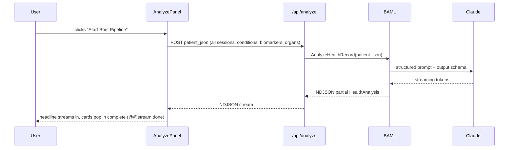
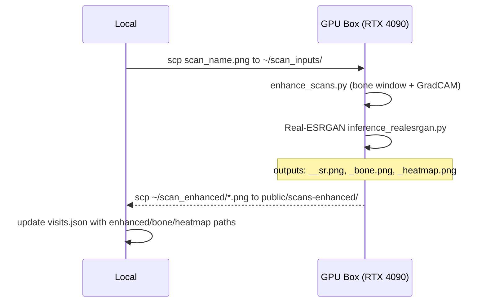
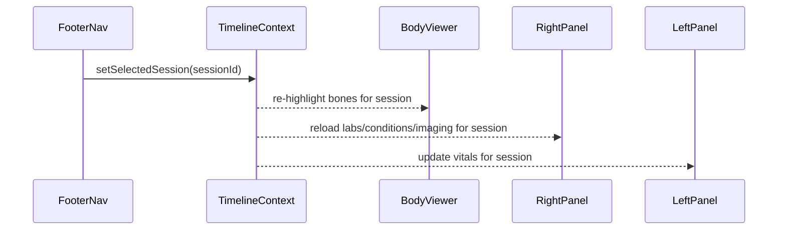

# 🧬 Soma
### *Your health, fully understood.*


https://github.com/user-attachments/assets/4da760a0-89c3-4797-8b01-212f1f53734c


The US healthcare system costs more per capita than any other country on earth. In return, patients get a "member portal" that is a maze of PDFs, broken filters, and lab results with zero context. No narrative. No trajectory. No signal. Just raw data buried behind three login screens and a fax machine mentality baked into software that should know better.

This is not a small insurer problem or a big insurer problem. It is an industry problem. The data exists. The scans exist. The bloodwork going back a decade exists. It is all sitting in systems that treat patients like claims numbers instead of people who deserve to understand their own biology. The technology to do better has existed for years. Nobody bothered.

So I downloaded my own records and built the platform they should have built.

**This is not a demo with static JSON.** I built real data extraction and ETL tooling to pull raw clinical data, biomarker metrics, and body scan imagery from source systems. I designed a data model that is actually useful end to end, not just a display layer on top of a flat export. I enhanced that data with machine learning: super-resolution imaging, density analysis, and AI attention heatmaps computed on a dedicated GPU pipeline. I synthesized the full patient timeline into a type-safe, structured LLM deep brief using BAML and Claude, streaming a clinical narrative that is genuinely useful, not just to patients like me, but to physicians, specialists, and every role in the medical supply chain who needs to understand a patient's full picture fast.

The 3D body is not decorative. Every bone in the skeleton is individually addressable and lights up based on real clinical findings, color-coded by severity. Toggle on the organ layer and 12 soft-tissue meshes appear in anatomically correct positions, each mapped to real CT findings. Toggle on the labs layer and out-of-range biomarkers anchor themselves spatially to the bones and organs they actually implicate. Bone annotation cards float in 3D space. The whole thing reacts to a timeline scrubber moving across years of clinical history. This is not a visualization of fake data. It is annotated with actual conditions from actual clinical notes, real biomarker values across real visits, and scan imagery processed from PACS.

The data is there. Do better. So I did.

Phases 1 through 5.6 — 3D skeleton, organ layer, biomarker mapping, ML imaging pipeline, and the full AI deep brief — were built in a single weekend. More is coming in the [roadmap](#roadmap).

> See the [roadmap](#roadmap) for what is coming next.

---

## ✨ Features

### 🦴 3D Skeleton Viewer
An interactive [Three.js](https://threejs.org/) skeleton rendered from `skeleton_lo.glb`, a rigged, mesh-precise model with individually named bones covering every major anatomical structure. Conditions from clinical data are mapped to specific bones and rendered with a three-tier highlight system:

- 🔴 **Red** for critical/active diagnoses
- 🟡 **Yellow** for watch conditions
- 🩵 **Cyan** for lab-flagged states

Bone annotations surface as compact glass cards via [`@react-three/drei`](https://github.com/pmndrs/drei)'s `<Html>` portal system, floating in 3D space at z-5, above the WebGL canvas but below the UI panels. The WebGL compositor layer is carefully controlled so the skeleton never bleeds through the glass interface.

---

### 🫀 12-Organ Layer
A toggleable soft-tissue layer overlaying GLB organ meshes directly onto the skeleton: liver, bilateral kidneys, heart, bilateral lungs, stomach, aorta, spleen, gallbladder, pancreas, and bladder. Nine meshes were extracted and calibrated from open anatomical datasets. The stomach and aorta were built from scratch in [Blender](https://www.blender.org/) using a custom MCP TCP addon:

- **Aorta:** Frenet-Serret tube mesh along a manually traced centerline
- **Stomach:** sculpted parametric volume

Every organ position is calibrated to the skeleton coordinate space with X-axis convention corrected for proper laterality. Real CT findings from imaging reports are mapped per organ and surface in the right panel when selected.

---

### 📅 Timeline Scrubber
A footer navigation scrubber across the full clinical timeline, from the first session on record (`2017-05`) through the most recent visit (`2026-02`). Every panel reacts:

- Skeleton re-highlights bones for the active session conditions
- Right panel reloads labs and imaging
- Left panel updates vitals

Session state is managed through a React context (`TimelineContext`) that all child panels subscribe to. Jumping between sessions is instant since all data is pre-loaded from static JSON at build time.

---

### 🧪 Labs Panel
Five sub-categories covering the full metabolic picture: **Hormone**, **Circulatory**, **Immune**, **Digestive**, and **Urinary**. 40+ individual biomarkers, each rendered as a metric card with:

- Animated count-up value on load
- Sparkline mini-chart showing trend across all sessions
- Normal range band for at-a-glance context

Values animate in with staggered timing on tab switch. The `AnimatedValue` component interpolates from zero to final value, decimal-aware, and replays cleanly when switching sub-tabs or sessions.

---

### 🔗 Chemistry to Body Mapping
Biomarker flags are spatially anchored to the 3D anatomy. Each marker in the data model carries `boneTargets` and `organTargets` arrays mapping the flagged value to specific anatomical structures. Out-of-range labs light up the corresponding bones or organs in cyan, creating a direct visual link between a blood panel result and the anatomical system it implicates. Seeing a low eGFR turn the kidneys cyan is not just cool. It is genuinely useful.

---

### 🩻 Imaging Tab
Visit scans surface as cards with study type, date, and findings preview. Hovering reveals "View Enhanced" which opens the single-scan deep-dive modal with three tabs:

| Tab | Description |
|-----|-------------|
| **Original** | Source scan pulled from PACS, 2x super-resolution applied |
| **Bone Window** | False-color density map (hot colormap) |
| **AI Attention** | GradCAM heatmap showing pathology model activation regions |

Every enhanced scan was processed offline on a GPU box and served as static assets. Zero ML at browser runtime.

---

### 🤖 ML Imaging Pipeline
An offline GPU pipeline that takes raw PNG scans and produces three enhanced variants per image. Runs on an NVIDIA RTX 4090 via SSH. The pipeline chains:

1. Bone window computation + GradCAM inference via `enhance_scans.py`
2. Real-ESRGAN super-resolution pass

Enhanced outputs are `scp`'d back to `public/scans-enhanced/` and paths registered in `visits.json`. Full runbook in [`IMAGING_PIPELINE.md`](IMAGING_PIPELINE.md).

---

### 💡 Deep Brief
The centerpiece. A [BAML](https://github.com/BoundaryML/baml)-structured streaming AI synthesis of the full medical record, powered by [Claude Sonnet](https://www.anthropic.com/claude). Hit "Start Brief Pipeline" and it POSTs the entire patient JSON (all sessions, conditions, biomarkers, imaging findings, organ states) to `/api/analyze`, which calls a BAML `AnalyzeHealthRecord` function with a typed output schema. Claude streams back a structured `HealthAnalysis` object:

- One-paragraph headline narrative
- Trajectory score 1-10
- Watchlist of concerning trends
- Ranked recommendation set
- Per-condition insight cards with mechanism explanations
- Lab highlights with clinical context

Citation chips link to actual peer-reviewed papers on [PubMed](https://pubmed.ncbi.nlm.nih.gov/), [arXiv](https://arxiv.org/), [AHA](https://www.heart.org/), and [WHO](https://www.who.int/). Not hallucinated links. Curated references embedded in the BAML prompt schema. This is the clinical brief your doctor never had time to write.

---

## 🛠 Tech Stack

| Layer | Technology |
|---|---|
| Framework | [Next.js 16.2.9](https://nextjs.org/) (App Router, Turbopack) |
| Language | TypeScript (strict) |
| Styling | [Tailwind CSS v4](https://tailwindcss.com/) (no config file, tokens in `globals.css`) |
| 3D | [Three.js](https://threejs.org/) via [`@react-three/fiber`](https://github.com/pmndrs/react-three-fiber) + [`@react-three/drei`](https://github.com/pmndrs/drei) |
| AI Structured Output | [BAML v0.223.0](https://github.com/BoundaryML/baml) |
| LLM | [Claude claude-sonnet-4-6](https://www.anthropic.com/claude) (Anthropic) |
| ML Pipeline | Python 3.10, [PyTorch](https://pytorch.org/) 2.6.0+cu124, [TorchXRayVision](https://github.com/mlmed/torchxrayvision), [Real-ESRGAN](https://github.com/xinntao/Real-ESRGAN) |
| GPU | NVIDIA RTX 4090, CUDA 12.2 |
| Deployment | [Netlify](https://www.netlify.com/) (Next.js SSR) |

---

## 🔬 ML Models

The imaging pipeline runs three separate passes. Here is what is actually happening under the hood.

### Real-ESRGAN (`RealESRGAN_x4plus`, `--outscale 2 --fp32`)

2x super-resolution on the raw scan PNG. Real-ESRGAN uses a generative adversarial network trained on degraded image pairs with realistic noise, compression, and blur modeling. At 2x scale it meaningfully sharpens trabecular and cortical bone detail in X-rays: fracture lines, joint space narrowing, and density heterogeneity that compress into mush at original resolution become readable. Run with `--fp32` to avoid half-precision artifacts on fine bone detail.

> 📄 Paper: [Real-ESRGAN: Training Real-World Blind Super-Resolution with Pure Synthetic Data](https://arxiv.org/abs/2107.10833)

---

### TorchXRayVision DenseNet-121 (`densenet121-res224-all`)

A DenseNet-121 trained on 112,120 chest X-rays across 14 pathology classes. The `densenet121-res224-all` checkpoint covers CheXpert, NIH ChestX-ray14, MIMIC-CXR, and PadChest in a unified label space. Used not for classification output but for **GradCAM spatial attention**: the gradient signal from `model.features.denseblock4.denselayer16.conv2` (the final dense layer before global average pooling) is backpropagated through the pathology logits and mapped back to pixel space as an attention heatmap.

Input normalization follows the TorchXRayVision convention:

```python
x = (pixel / 255) * 2048 - 1024  # expects [-1024, 1024] float range
```

The result is a per-pixel relevance map showing which regions the model pathology-trained features activate on. Clinically interesting even when the classifications themselves are noisy on non-chest anatomy.

> 📄 Papers: [CheXNet (Rajpurkar et al.)](https://arxiv.org/abs/1711.05225) · [Grad-CAM (Selvaraju et al.)](https://arxiv.org/abs/1610.02391) · [TorchXRayVision](https://github.com/mlmed/torchxrayvision)

---

### Bone Window (numpy pipeline)

Not a model. A signal processing pass. Takes the grayscale scan, stretches intensity to the 15th-98th percentile range (clipping air and saturated bone), then maps through matplotlib `cm.hot` colormap:

| Color | Tissue |
|-------|--------|
| ⬛ Black | Air |
| 🟫 Dark red | Low-density soft tissue |
| 🟠 Orange/yellow | Intermediate tissue |
| ⬜ White | Cortical bone |

Surfaces density gradients that are invisible in the grayscale original. Implemented in pure numpy + matplotlib, runs in under a second per image on CPU.

---

## 🔄 Sequence Diagrams

### Deep Brief Pipeline



### ML Imaging Enhancement Pipeline



### Timeline Data Flow



---

## 🗺 Roadmap

### ✅ Done

| Phase | What shipped |
|-------|-------------|
| **Phase 1** | Skeleton wireframe, per-bone highlight, annotation cards, glass system |
| **Phase 2** | Timeline scrubber, real patient data (`conditions_real.json`, `biomarkers.json`, `visits.json`), visit-centric RightPanel |
| **Phase 3** | 12-organ GLB layer (9 extracted from open datasets, stomach + aorta built in Blender via MCP) |
| **Phase 4** | Chemistry to body mapping, `lab-highlights.json`, 5 biomarker sub-tabs, 40+ markers |
| **Phase 5** | Deep Brief: BAML streaming, Claude Sonnet, citation chips, sarcastic loader, ConditionInsightCard |
| **Phase 5.5** | ML imaging pipeline: Real-ESRGAN SR + bone window + GradCAM, ScanModal deep-dive |
| **Phase 5.6** | Soma rebrand, OG/Twitter meta, terminal pipeline idle state, Deep Brief UI polish |

---

### 🔜 TODO

**Phase 6: Real FHIR Data**
Replace the static JSON layer with a live FHIR API. Firebase Auth + Firestore for session persistence. The `visits.json` schema already maps cleanly to the FHIR Encounter resource model. This is a data-plumbing problem, not an architecture problem.

> 🔗 [FHIR R4 Encounter](https://www.hl7.org/fhir/encounter.html) · [Firebase](https://firebase.google.com/)

**Phase 7: Patient-Specific Skeleton**
The current skeleton is a generic anatomical model. The goal is to generate a patient-specific mesh from actual DICOM scans using [TotalSegmentator](https://github.com/wasserth/TotalSegmentator) and [X2BR](https://arxiv.org/abs/2504.08675) (bone reconstruction from X-ray, arXiv:2504.08675) or DIFR3CT. Philips IntelliSpace PACS access is already established. This closes the loop from "a skeleton that looks like you" to "the actual skeleton that is you."

**SpineFM: Vertebrae Labeling**
Label L1-L5 and C1-C7 directly on X-ray as a spatial overlay inside ScanModal. Disc space narrowing and vertebral changes are in the imaging reports. This makes them visually locatable without a radiologist.

**BioViL-T + MedSAM2: Condition Grounding**
Condition text to highlighted region on scan. Feed a condition string ("mild cardiomegaly", "right lower lobe consolidation") into a grounded vision-language model and get a bounding region back. [MedSAM2](https://github.com/bowang-lab/MedSAM) for pixel-precise segmentation. This turns the imaging tab into something genuinely diagnostic.

> 📄 [BioViL-T](https://arxiv.org/abs/2301.04558) · [MedSAM2](https://arxiv.org/abs/2408.00874)

**Two-Session Scan Diff**
Side-by-side comparison in ScanModal for the same body region across two visits. Progression tracking. The data model supports it. The UI just needs a split-pane mode.

**Two-Phase Deep Brief**
Call 1 (fast): headline, trajectory score, watchlist, and action items stream immediately. Call 2 (deep): condition insight cards and citations stream after. User has something actionable in under 3 seconds without waiting for full synthesis. Currently both phases are one blocking call.

---

## 🚀 Running Locally

```bash
git clone https://github.com/p5150j/-Soma-Health.git
cd -Soma-Health
npm install

# Create .env.local and add your Anthropic API key:
echo "ANTHROPIC_API_KEY=sk-ant-..." > .env.local

npm run dev -- -p 3000
```

Open [http://localhost:3000](http://localhost:3000).

The Deep Brief requires a valid `ANTHROPIC_API_KEY`. All other features (3D viewer, timeline, labs, imaging) run fully offline from static JSON and pre-built assets.

---

## 📊 Data

All health data in this app is real personal health records exported from a major US health insurer's member portal and supplemented with direct PACS imaging access. Names and identifiers have been modified for privacy. Condition annotations are derived from actual clinical notes and imaging reports. The biomarker ranges, trend directions, and lab flags reflect real results across real visits.

This is not a synthetic demo. That is the whole point.

---

## 📄 License

MIT. Build something better with your own data.
