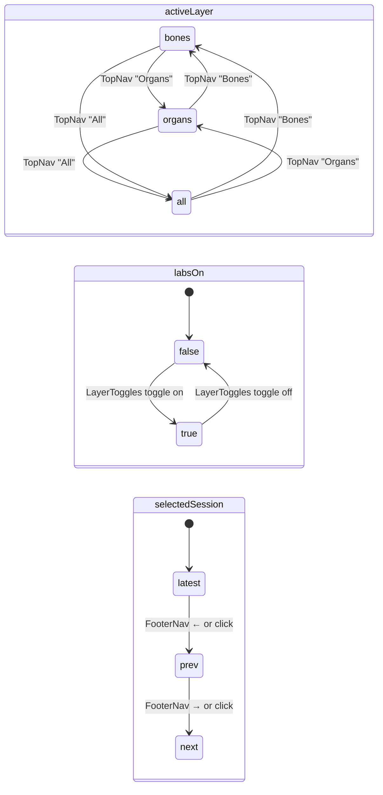
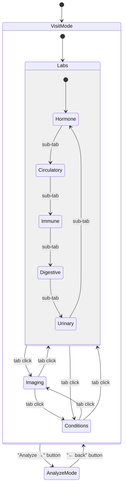
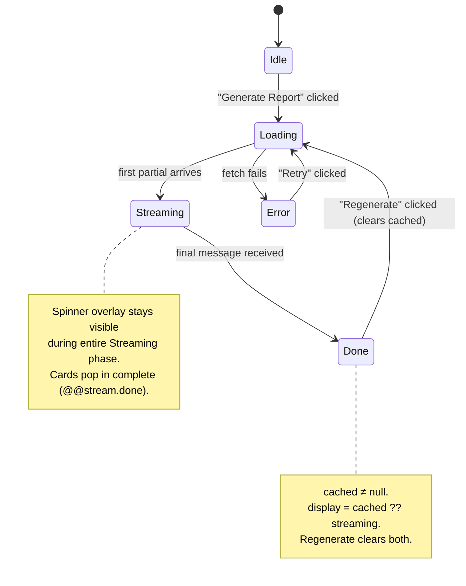

# UI Architecture & Component Guide

This document covers the full component hierarchy, shared state, data flow from JSON files to rendered UI, critical rendering constraints (WebGL/React boundary, z-index stack, glass system), and state machines for key interactive components.

---

## Component Tree

```
src/app/page.tsx  (root layout, Server Component)
│
├── TimelineProvider          context/TimelineContext.tsx — shared session + layer state
│
├── BodyViewerLoader          components/BodyViewerLoader.tsx — Suspense boundary
│   └── BodyViewer            components/BodyViewer.tsx — Three.js R3F canvas (z-0)
│       ├── [bone meshes]     scene.traverse() — skeleton_lo.glb, per-bone MeshBasicMaterial
│       ├── BoneAnnotation[]  components/BoneAnnotation.tsx — drei <Html> portalled to #bone-annotation-portal
│       └── OrganLayer        components/OrganLayer.tsx — GLB organ meshes, conditional on activeLayer
│           └── [organ meshes + BoneAnnotation cards]
│
├── TopNav                    components/TopNav.tsx — layer mode toggle (Bones/Organs/All), z-50
│
├── LeftPanel                 components/LeftPanel.tsx — patient profile, vitals, visit mini-cards
│   └── CountUp               inline component — animated number on mount (cubic ease-out)
│
├── RightPanel                components/RightPanel.tsx — dual-mode panel (visit | analyze)
│   │
│   ├── [visit mode]
│   │   ├── MetricCard[]      components/MetricCard.tsx — lab values per category
│   │   │   ├── AnimatedValue inline component — count-up from 0, decimal-aware
│   │   │   └── MiniChart     components/MiniChart.tsx — reference range bar chart
│   │   ├── [imaging tab]     inline — session-keyed scan thumbnails from visits.json
│   │   └── [conditions tab]  inline — 2-col masonry, skeletal + organ findings
│   │
│   └── [analyze mode]
│       └── AnalyzePanel      components/AnalyzePanel.tsx — streaming Claude analysis
│           ├── ConditionCard inline — instrument-panel card (name/urgency/metrics/clinical)
│           └── LabCard       inline — marker + value + interpretation
│
├── FooterNav                 components/FooterNav.tsx — session scrubber timeline, z-50
├── LayerToggles              components/LayerToggles.tsx — labs on/off toggle, bottom-left
└── MouseHint                 components/MouseHint.tsx — WebGL navigation hint, bottom-right, z-50

#bone-annotation-portal       <div> in page.tsx — z-5, drei Html renders BoneAnnotation cards here
```

---

## Shared State — `TimelineContext`

Single context wrapping the entire app. All interactive state that crosses component boundaries lives here.

```typescript
interface TimelineContextValue {
  // Session
  sessions:           Session[]        // loaded from conditions_real.json
  selectedSession:    string           // default: latest session id
  setSelectedSession: (id: string) => void

  // 3D layer visibility
  activeLayer:        LayerMode        // 'bones' | 'organs' | 'all' | 'none'
  setActiveLayer:     (l: LayerMode) => void

  // Lab highlight overlay
  labsOn:             boolean          // default: false
  setLabsOn:          (v: boolean) => void
  labTargets:         LabHighlight[]   // derived — filtered by selectedSession
}
```

### State diagram



`labTargets` is a `useMemo` derived from `selectedSession` — never set directly.

---

## RightPanel State Machine



### AnalyzePanel internal state



---

## Data Flow

```
JSON files (src/data/)
│
├── conditions_real.json     → TimelineContext.sessions
│                            → BodyViewer (bone highlights per session)
│                            → RightPanel Conditions tab
│                            → AnalyzePanel (via buildPatientJson)
│
├── conditions_organs.json   → OrganLayer (organ highlights per session)
│                            → RightPanel Conditions tab (organs section)
│                            → AnalyzePanel (via buildPatientJson)
│
├── biomarkers.json          → RightPanel Labs tab (MetricCard per marker)
│                            → MiniChart (rangeMin/normalMin/normalMax/rangeMax/mean)
│                            → AnalyzePanel (via buildPatientJson)
│
├── lab-highlights.json      → TimelineContext.labTargets (derived, per session)
│                            → BodyViewer (cyan bone fills when labsOn)
│                            → OrganLayer (cyan organ fills when labsOn)
│                            → AnalyzePanel (via buildPatientJson)
│
└── visits.json              → RightPanel Imaging tab (session-keyed thumbnails)
```

---

## WebGL / React Rendering Boundary

The Three.js canvas GPU-composites above HTML elements by default — panels bleed through the skeleton unless the stacking is explicitly forced.

### Z-index stack (load-bearing — do not change without understanding this)

```
z-0    canvas wrapper          explicit — prevents WebGL from floating above panels
z-5    #bone-annotation-portal  drei Html BoneAnnotation cards — above canvas, below panels
z-10   panels wrapper          + [transform:translate3d(0,0,0)] — forces own GPU compositor layer
z-50   TopNav, FooterNav, MouseHint
```

The `[transform:translate3d(0,0,0)]` on the panels wrapper is **required**. It promotes panels to their own GPU compositor layer so they render above the WebGL canvas. Removing it causes the skeleton to bleed through all glass cards.

```tsx
// page.tsx — the critical wrapper
<div className="absolute inset-0 top-14 bottom-0 flex justify-between pointer-events-none z-10 [transform:translate3d(0,0,0)]">
```

### Why `#bone-annotation-portal`

drei's `<Html>` component renders into a portal so it can position HTML elements at 3D world coordinates. The portal div lives at z-5 — above the canvas so annotations appear in front of bones, but below z-10 panels so glass cards always win.

---

## Glass System

All floating surfaces use identical treatment. Never deviate from this.

```tsx
className="glass-panel backdrop-blur-[40px] backdrop-saturate-150"
```

- `.glass-panel` is defined in `globals.css`: `bg-[rgba(18,18,20,0.55)]`, border `rgba(255,255,255,0.07)`, `border-radius: 16px`, `box-shadow`
- `backdrop-blur` and `backdrop-saturate` **must be Tailwind utility classes on the JSX element** — never in the `globals.css` custom class definition. Tailwind v4 strips the `backdrop-filter` shorthand from `@layer` custom CSS.

---

## Design Tokens (`src/app/globals.css`)

| Token | Value | Usage |
|---|---|---|
| `bg-lime` / `text-lime` | `#3EFFC0` | Primary accent — CTAs, improving trajectory, positive labs |
| `bg-red-alert` / `text-red-alert` | `#ff453a` | Critical severity, urgent findings, negative trends |
| `bg-yellow-warn` / `text-yellow-warn` | `#f5a623` | Watch severity, new findings, caution |
| `bg-green-ok` / `text-green-ok` | (defined in globals) | Normal/stable lab indicators |

Custom values that don't exist as tokens go in `globals.css` under `@theme inline {}`. Never use inline `style={{}}` objects.

---

## Animated Numbers

### `CountUp` (LeftPanel — hardcoded vitals)

Cubic ease-out count from 0 to a fixed target on mount. Each vital has a unique duration:

| Vital | Duration | Rationale |
|---|---|---|
| O₂ Sat | 850ms | Fastest — simple sensor reading |
| Weight | 1100ms | |
| Visits | 1350ms | |
| Temp | 1600ms | |
| BMI | 2100ms | Last — "calculated from multiple inputs" |

### `AnimatedValue` (MetricCard — dynamic lab values)

Value arrives as a `string` from data. Key details:
- `decimalsOf(str)` reads decimal count from the source string to preserve format exactly (`"2.4"` → 1 decimal, `"245"` → 0)
- Duration = `900 + seed × 190ms` — `seed` prop (already `i+1` from lab array) gives per-card stagger for free
- `useEffect` deps include `value` — animation replays on category switch and session switch

---

## Bone Targeting Convention

Meshes in `skeleton_lo.glb` follow the pattern `<bone-name>_beige_0`. Examples:

```
l5_beige_0        Lumbar 5
r_femur_beige_0   Right femur
Sternum_beige_0   Sternum
```

Full list in `skeleton-nodes.json`. To highlight a bone: match `child.name` in `scene.traverse()` inside `BodyViewer.tsx` and apply a `MeshBasicMaterial`. Collect targets into an array first — do NOT modify materials inside `traverse()` (infinite recursion risk).

---

## Organ Layer Convention

Organs live in `public/organs/<key>.glb`. The `ORGANS` array in `OrganLayer.tsx` defines:

```typescript
{
  key:        string          // matches conditions_organs.json organ key
  label:      string
  modelUrl:   string          // '/organs/<key>.glb'
  modelScale: number          // calibrated per organ
  position:   [x, y, z]      // world coords relative to skeleton center y=0
  rotateY?:   number
  flipX?:     boolean
}
```

X-axis convention: patient's left = viewer's right = **positive X**. All organ X offsets follow this. Lungs are exempt (their `rotateY` + `flipX` already handles orientation).

No Draco compression on organ GLBs — Draco without a decoder crashes the WebGL context.

---

## Adding a New Data Layer (pattern)

1. Create `src/data/<layer>-conditions.json` — same shape as `conditions_real.json`
2. Add lookup map in `BodyViewer.tsx` (bone mesh targets) or `OrganLayer.tsx` (organ targets)
3. Add context flag in `TimelineContext` if it needs independent toggle
4. Add toggle button to `LayerToggles` or `TopNav`
5. Filtering by session: `.filter(c => c.session === selectedSession)`
